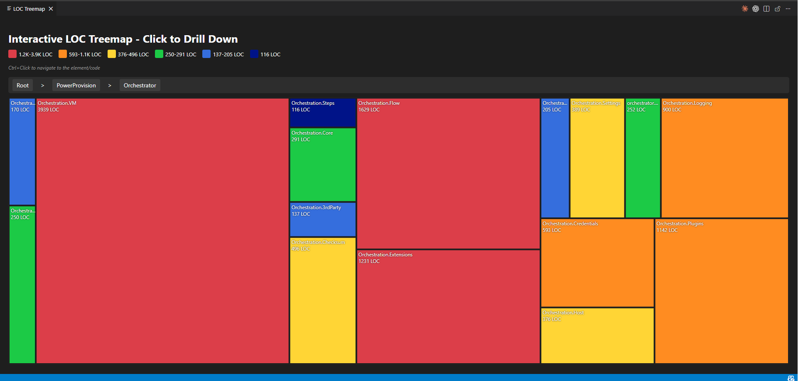
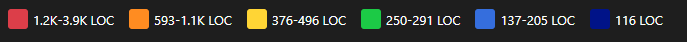
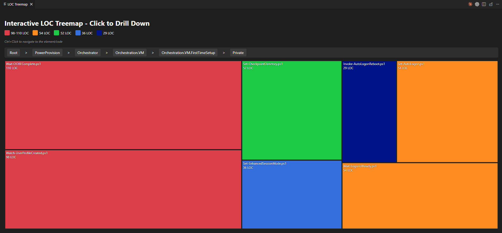
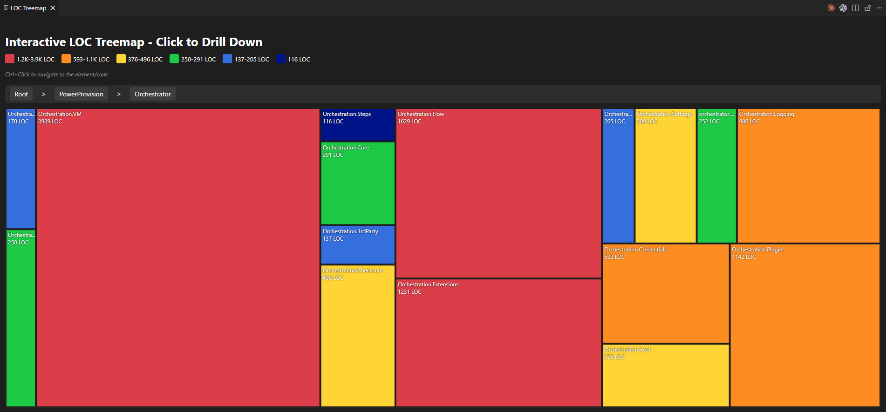
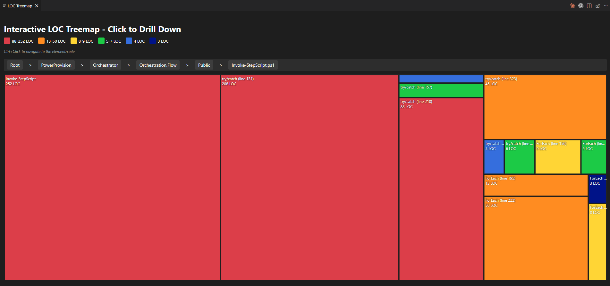

# CodeAtlas

**Interactive hierarchical LOC treemap visualization for VS Code**

Explore your codebase visually with an interactive drill-down treemap that reveals the structure, size, and complexity of your project at a glance.



## Why CodeAtlas?

Understanding code complexity and distribution is crucial for:

- **Identifying hotspots**: Quickly spot the largest files and functions that need attention
- **Code review prioritization**: Focus on areas with the most complexity
- **Refactoring decisions**: Visualize which components are growing out of control
- **Team onboarding**: Help new developers understand project structure instantly
- **Technical debt tracking**: See where code mass is accumulating

Traditional file explorers show structure but hide size. Line counters show size but hide structure. **CodeAtlas shows both at once.**

## Features

### 🗺️ Hierarchical Drill-Down Navigation
Click any rectangle to zoom into that folder, file, or code block. Use breadcrumbs to navigate back up.


### 🌡️ Size-Based Color Coding
Heat gradient from **red (largest)** → **orange** → **yellow** → **green** → **blue (smallest)** makes hotspots obvious.



### 🎯 Direct Code Navigation
**Ctrl+Click** any file or code block to jump directly to that location in your editor - with exact line numbers.


### 📊 Multiple Hierarchy Levels
- **Folder level**: See which directories dominate your codebase
- **File level**: Identify large files within folders
- **Code block level**: Drill into functions, classes, methods with exact LOC and line numbers



### 🔤 Multi-Language Support
Built-in support for:
- **PowerShell** (.ps1, .psm1) - AST-based parsing
- **C#** (.cs) - Methods and classes
- **AutoHotkey** (.ahk, .ahk2) - Functions, hotkeys, labels

**Extensible**: Add your own language parsers (see [Creating Custom Parsers](PARSERS.md))

### 📈 Smart File Discovery
- **Git-tracked files** (default): Scan only committed files
- **Full repository scan**: Optional deep scan of all files
- **Configurable filtering**: Ignore dot-folders, customize extensions

## Installation

### From VSIX (Local)
1. Download the latest `.vsix` from releases
2. Open VS Code → Extensions (`Ctrl+Shift+X`)
3. Click `...` menu → `Install from VSIX`
4. Select the downloaded file

### From Marketplace (Coming Soon)
Search for "CodeAtlas" in VS Code Extensions

## Usage

### Basic Workflow
1. Open any workspace in VS Code
2. Press `Ctrl+Shift+P` (Command Palette)
3. Type: `CodeAtlas: Show Treemap`
4. **Click** rectangles to drill down
5. **Ctrl+Click** to jump to code

### First Run Setup
On first execution, CodeAtlas creates `.vscode/CodeAtlas/` in your workspace with:
- `treemap.html` - Generated visualization (auto-updated)
- `LanguageParsers/` - Custom parser directory
- `README.md` - Quick reference for custom parsers

## Configuration

All settings are optional with smart defaults.

### Language Selection
```json
"codeAtlas.languages.powershell": true,  // Default: enabled
"codeAtlas.languages.csharp": true,      // Default: enabled
"codeAtlas.languages.autohotkey": false  // Default: disabled
```

### Scanning Behavior
```json
"codeAtlas.scanEntireRepo": false,       // Use git-tracked files only
"codeAtlas.ignoreDotFolders": true       // Skip .git, .vscode, etc.
```

### Color Customization
```json
"codeAtlas.colors.color1": "#d73a49",    // Hottest (largest LOC)
"codeAtlas.colors.color2": "#ff8c00",
"codeAtlas.colors.color3": "#ffd700",
"codeAtlas.colors.color4": "#32cd32",
"codeAtlas.colors.color5": "#4169e1",
"codeAtlas.colors.color6": "#00008b"     // Coldest (smallest LOC)
```

## Extending CodeAtlas

Want to visualize Python, Java, Rust, or any other language? 

👉 **See [Creating Custom Parsers (PARSERS.md)](PARSERS.md)** for a complete guide with templates and examples.

**Quick Overview:**
1. Create `YourLanguage.ps1` in `.vscode/CodeAtlas/LanguageParsers/`
2. Add `.EXTENSIONS` metadata
3. Implement two functions: `Get-YourLanguageBlocks` and `Get-YourLanguageCommentPatterns`
4. Reload VS Code - done!

Your parsers are automatically discovered and integrated.

## Requirements

- **VS Code**: 1.85.0 or higher
- **PowerShell**: 7.0+ installed and in PATH

## How It Works

1. **Discovery**: Extension finds all files matching enabled language extensions
2. **Parsing**: Each file is analyzed using AST/regex to extract code blocks
3. **Tree Building**: Files → Folders → Code Blocks hierarchy is constructed
4. **Rendering**: D3.js treemap layout with color gradient applied
5. **Display**: Interactive HTML visualization in VS Code webview

**Privacy**: All processing happens locally. No data leaves your machine.

## Screenshots

### Overview - Folder Level


### Drill-Down - File Level


### Deep Dive - Code Block Level


### Dark Theme Compatible


## Use Cases

### 📦 Refactoring Planning
Identify god classes and oversized modules that need splitting.

### 🔍 Code Review
Focus review effort on the largest/newest changes.

### 🧹 Technical Debt Tracking
Monitor which areas are growing unchecked over time.

### 🎓 Learning New Codebases
Understand project structure and where functionality lives.

### 📊 Architecture Visualization
See if actual code distribution matches intended architecture.

## Performance

- **Small projects** (<100 files): Instant (<1 second)
- **Medium projects** (100-1,000 files): 2-5 seconds
- **Large projects** (1,000-10,000 files): 10-30 seconds

Scanning happens once per command invocation. Results are cached until next run.

## Troubleshooting

### Treemap doesn't appear
- Check Output → CodeAtlas for error messages
- Verify PowerShell 7+ is installed: `pwsh --version`
- Ensure workspace has code files matching enabled languages

### Missing files
- Enable `scanEntireRepo: true` if files aren't git-tracked
- Check language extension settings are enabled

### Custom parser not loading
- Verify file is in `.vscode/CodeAtlas/LanguageParsers/*.ps1`
- Check `.EXTENSIONS` metadata is present
- Reload VS Code window after adding parser

## Contributing

Contributions welcome! 

- **Bug reports**: Open an issue on GitHub
- **Feature requests**: Start a discussion
- **Language parsers**: Submit a PR with your parser in `LanguageParsers/`
- **Documentation**: Improvements always appreciated

## License

**Unlicense** - Public Domain

This software is free and unencumbered. Use it however you want - commercial, personal, modify, redistribute, sell. No restrictions, no attribution required.

See [LICENSE](LICENSE) for full text.

## Changelog

See [CHANGELOG.md](CHANGELOG.md) for version history.

## Acknowledgments

Built with:
- [D3.js](https://d3js.org/) - Treemap visualization
- PowerShell 7 - Cross-platform scripting
- VS Code Extension API

Inspired by tools like WinDirStat and Gource that make data structure tangible.

---

**Made with 🗺️ by the QualityAssurance team**